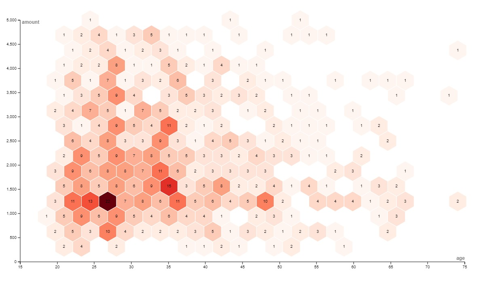

# Visualización de datos - PEC 2

Esta web forma parte entrega de la prueba de evaluación continua nº2 de la asignatura Visualización de Datos del Máster Universitario en ciencia de datos de la UOC.

## Visualización 1 - Sanky Diagrams

## Visualización 2 - Gauge diagram

## Visualización 3 - Hexagon Binning

Fuente: Kaggle: [German Credit](https://www.kaggle.com/datasets/shravan3273/credit-approval)
